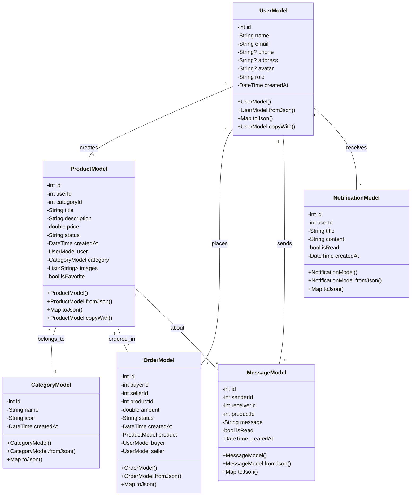
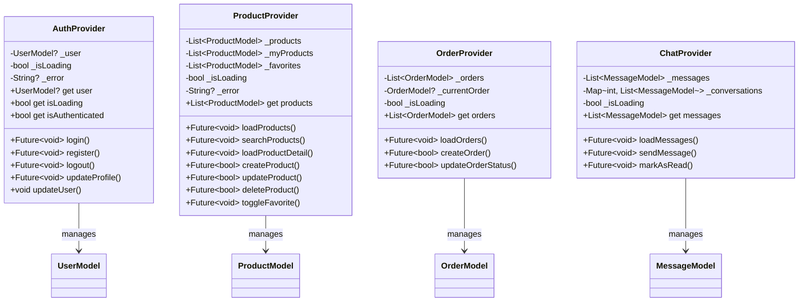
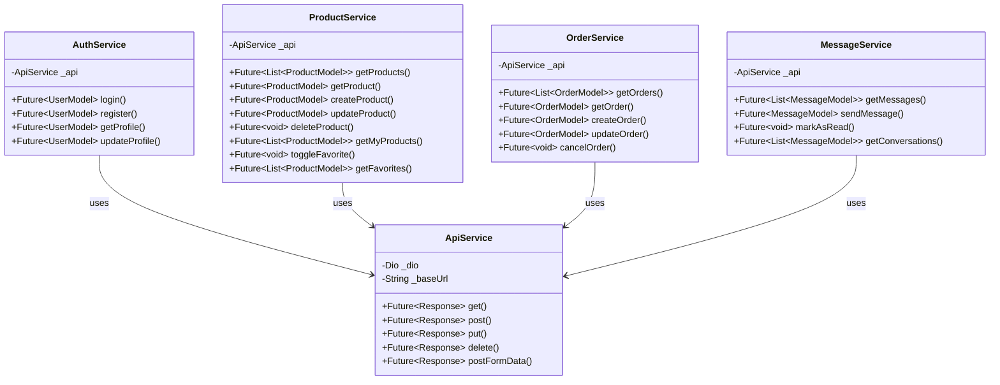
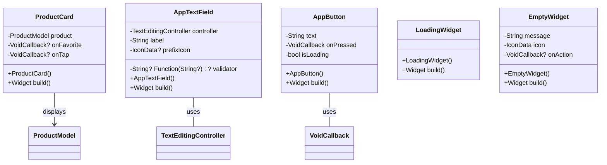
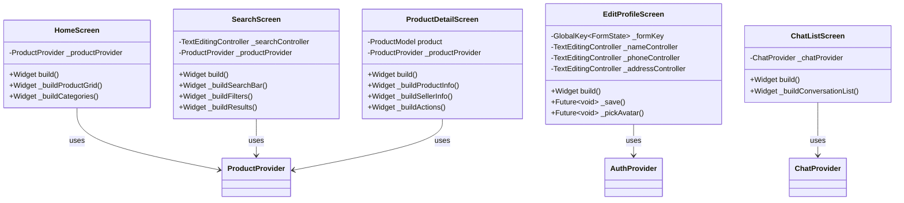
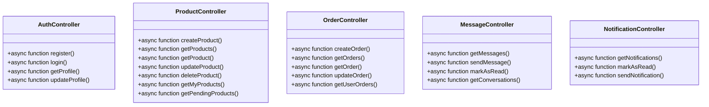
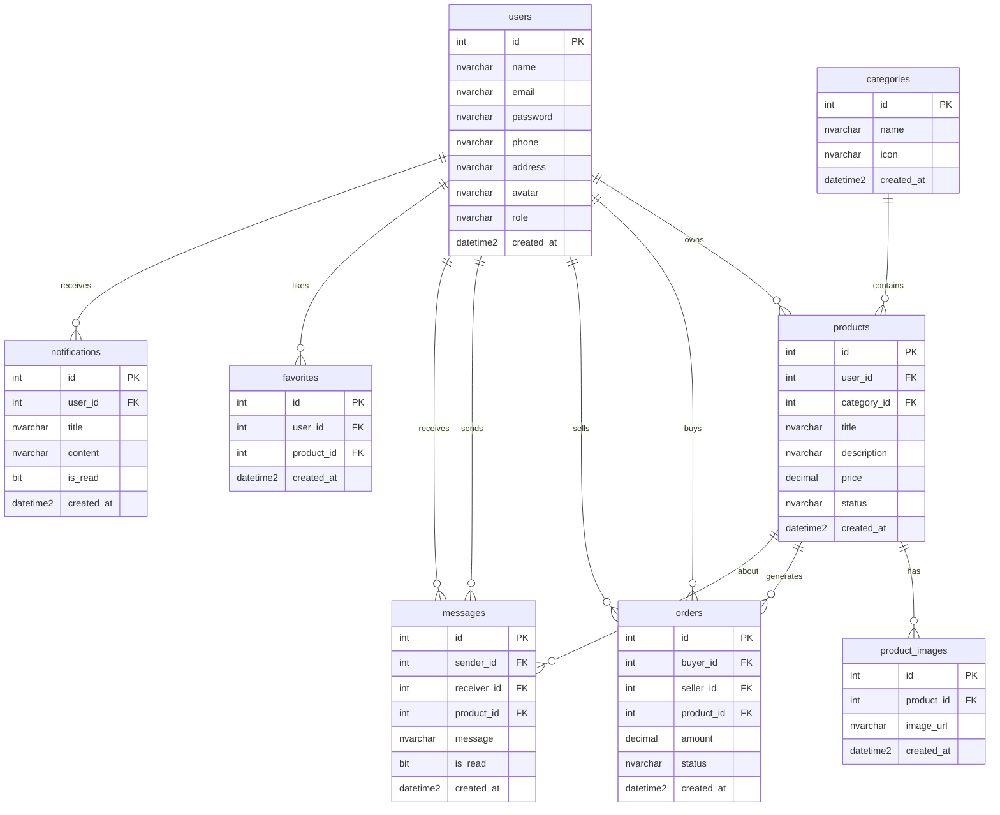

# Biểu Đồ Lớp - SecondHand App (Mermaid Version)

## 1. Frontend Models

## 2. State Management (Providers)

## 3. API Services

## 4. UI Components (Widgets)

## 5. Screens

## 6. Backend Controllers

## 7. Database Schema

## Chú thích

### Các lớp chính:
- **Models**: Dữ liệu đầu vào/ra của hệ thống
- **Providers**: Quản lý state (Flutter Provider pattern)
- **Services**: Giao tiếp với backend API
- **Widgets**: UI components tái sử dụng
- **Screens**: Các màn hình chính của ứng dụng
- **Controllers**: Business logic ở backend
- **Database**: Cấu trúc dữ liệu SQL Server

### Các mối quan hệ:
- **Association**: Classes sử dụng lẫn nhau
- **Aggregation**: "has-a" relationship
- **Composition**: "part-of" relationship
- **Inheritance**: "is-a" relationship
- **Dependency**: Tạm thời sử dụng

### Design Patterns:
- **Repository Pattern**: Services layer
- **Provider Pattern**: State management
- **MVC Pattern**: Controllers + Views
- **DTO Pattern**: Models for data transfer
