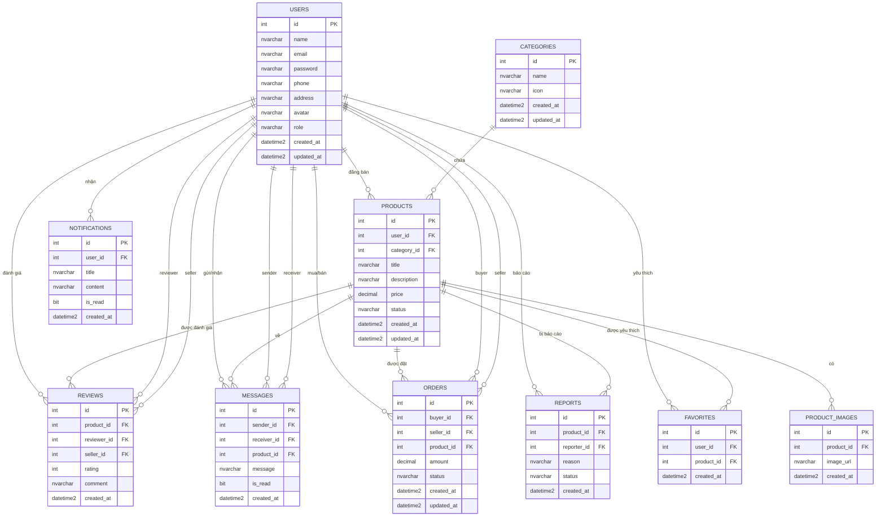
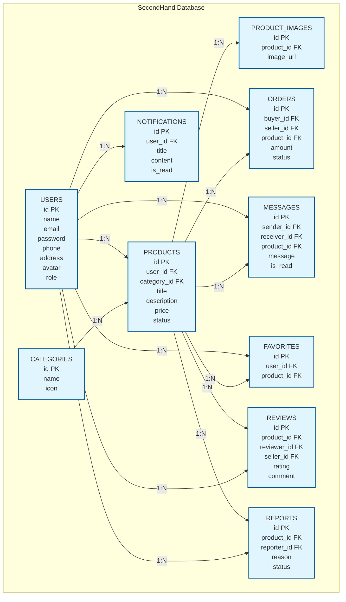

# 5.2 PHÂN TÍCH VÀ THIẾT KẾ CƠ SỞ DỮ LIỆU

## a. Các đối tượng - thực thể

### 📋 Danh sách các thực thể chính

#### 1. **Người dùng (User)**
- **Mục đích:** Lưu trữ thông tin tài khoản người dùng
- **Đặc điểm:** Mỗi người dùng có thể là buyer hoặc seller
- **Thuộc tính chính:** ID, tên, email, password, SĐT, địa chỉ, avatar, vai trò

#### 2. **Sản phẩm (Product)**
- **Mục đích:** Quản lý thông tin sản phẩm đăng bán
- **Đặc điểm:** Thuộc về một người dùng, một danh mục
- **Thuộc tính chính:** ID, tên sản phẩm, mô tả, giá, trạng thái, thời gian đăng

#### 3. **Danh mục (Category)**
- **Mục đích:** Phân loại sản phẩm
- **Đặc điểm:** Cấu trúc cây, có icon đại diện
- **Thuộc tính chính:** ID, tên danh mục, icon

#### 4. **Hình ảnh sản phẩm (Product Image)**
- **Mục đích:** Lưu trữ nhiều hình ảnh cho mỗi sản phẩm
- **Đặc điểm:** Một sản phẩm có nhiều hình ảnh
- **Thuộc tính chính:** ID, URL hình ảnh, ID sản phẩm

#### 5. **Đơn hàng (Order)**
- **Mục đích:** Quản lý giao dịch mua bán
- **Đặc điểm:** Liên kết buyer, seller, product
- **Thuộc tính chính:** ID, ID buyer, ID seller, ID product, số tiền, trạng thái

#### 6. **Tin nhắn (Message)**
- **Mục đích:** Giao tiếp giữa buyer và seller
- **Đặc điểm:** Real-time, liên kết với sản phẩm
- **Thuộc tính chính:** ID, người gửi, người nhận, nội dung, trạng thái đọc

#### 7. **Yêu thích (Favorite)**
- **Mục đích:** Lưu sản phẩm yêu thích của người dùng
- **Đặc điểm:** Liên kết many-to-many giữa user và product
- **Thuộc tính chính:** ID, ID user, ID product

#### 8. **Thông báo (Notification)**
- **Mục đích:** Gửi thông báo cho người dùng
- **Đặc điểm:** Push, email, in-app
- **Thuộc tính chính:** ID, ID user, tiêu đề, nội dung, trạng thái đọc

#### 9. **Đánh giá (Review)**
- **Mục đích:** Đánh giá sản phẩm và seller
- **Đặc điểm:** Có rating sao và comment
- **Thuộc tính chính:** ID, ID product, ID reviewer, rating, comment

#### 10. **Báo cáo (Report)**
- **Mục đích:** Báo cáo vi phạm
- **Đặc điểm:** User báo cáo sản phẩm/người dùng khác
- **Thuộc tính chính:** ID, ID reporter, ID đối tượng, lý do, trạng thái

### 📊 Phân loại thực thể

#### **Thực thể mạnh (Strong Entities)**
- **User:** Tồn động độc lập
- **Category:** Tồn tại độc lập
- **Product:** Phụ thuộc vào User và Category nhưng có business key riêng

#### **Thực thể yếu (Weak Entities)**
- **Product Image:** Phụ thuộc vào Product
- **Message:** Phụ thuộc vào User và Product
- **Favorite:** Phụ thuộc vào User và Product
- **Notification:** Phụ thuộc vào User

#### **Thực thể kết hợp (Associative Entities)**
- **Order:** Kết hợp User, Product, Transaction
- **Review:** Kết hợp User, Product, Rating
- **Report:** Kết hợp User, Product, Violation

### 🔗 Mối quan hệ giữa thực thể

#### **One-to-Many (1-N)**
- User ↔ Product (1 user đăng nhiều sản phẩm)
- User ↔ Order (1 user có nhiều đơn hàng)
- Category ↔ Product (1 danh mục có nhiều sản phẩm)
- Product ↔ Product Image (1 sản phẩm có nhiều hình ảnh)

#### **Many-to-Many (N-M)**
- User ↔ Product (qua Favorite, Review, Report)
- User ↔ User (qua Message, Order)

#### **One-to-One (1-1)**
- User ↔ User Profile (extension)
- Product ↔ Product Status (status tracking)

---

## b. Mô hình thực thể kết hợp (ERD)



### 📝 Giải thích ERD

#### **Các ký hiệu:**
- **PK**: Primary Key (Khóa chính)
- **FK**: Foreign Key (Khóa ngoại)
- **||--o{**: One-to-Many relationship
- **||--|{**: One-to-One relationship
- **}o--|{**: Many-to-Many relationship

#### **Các mối quan hệ chính:**
1. **USERS ↔ PRODUCTS**: Một user đăng nhiều sản phẩm
2. **USERS ↔ ORDERS**: User có thể là buyer hoặc seller
3. **PRODUCTS ↔ PRODUCT_IMAGES**: Một sản phẩm có nhiều hình ảnh
4. **USERS ↔ MESSAGES**: Real-time communication
5. **PRODUCTS ↔ FAVORITES**: Many-to-many qua associative entity

---

## c. Mô hình vật lý (PDM)

### 🏗️ Chuẩn hóa mức 3 (3NF)

#### **First Normal Form (1NF)**
- ✅ Tất cả các thuộc tính đều atomic (không thể chia nhỏ)
- ✅ Tất cả các bản ghi đều unique qua primary key
- ✅ Không có repeating groups

#### **Second Normal Form (2NF)**
- ✅ Đã đạt 1NF
- ✅ Tất cả non-key attributes đều fully dependent trên primary key
- ✅ Loại bỏ partial dependencies

**Ví dụ:** 
- ❌ Trước: Products có category_name trực tiếp
- ✅ Sau: Tách thành Categories riêng

#### **Third Normal Form (3NF)**
- ✅ Đã đạt 2NF
- ✅ Không có transitive dependencies
- ✅ Non-key attributes không phụ thuộc vào các non-key attributes khác

**Ví dụ:**
- ❌ Trước: Users có district_name, city_name
- ✅ Sau: Tách thành Districts, Cities riêng (nếu cần)

### 📊 Mô hình vật lý chi tiết

```sql
-- Table: USERS
CREATE TABLE USERS (
    id INT IDENTITY(1,1) PRIMARY KEY,
    name NVARCHAR(120) NOT NULL,
    email NVARCHAR(255) NOT NULL UNIQUE,
    password NVARCHAR(255) NOT NULL,
    phone NVARCHAR(30) NULL,
    address NVARCHAR(255) NULL,
    avatar NVARCHAR(500) NULL,
    role NVARCHAR(20) NOT NULL DEFAULT 'user',
    created_at DATETIME2(0) NOT NULL DEFAULT SYSUTCDATETIME(),
    updated_at DATETIME2(0) NOT NULL DEFAULT SYSUTCDATETIME(),
    
    CONSTRAINT CK_USERS_ROLE CHECK (role IN ('user', 'admin'))
);

-- Table: CATEGORIES
CREATE TABLE CATEGORIES (
    id INT IDENTITY(1,1) PRIMARY KEY,
    name NVARCHAR(100) NOT NULL UNIQUE,
    icon NVARCHAR(50) NULL,
    created_at DATETIME2(0) NOT NULL DEFAULT SYSUTCDATETIME(),
    updated_at DATETIME2(0) NOT NULL DEFAULT SYSUTCDATETIME()
);

-- Table: PRODUCTS
CREATE TABLE PRODUCTS (
    id INT IDENTITY(1,1) PRIMARY KEY,
    user_id INT NOT NULL,
    category_id INT NOT NULL,
    title NVARCHAR(200) NOT NULL,
    description NVARCHAR(MAX) NULL,
    price DECIMAL(18,2) NOT NULL CHECK (price >= 0),
    status NVARCHAR(20) NOT NULL DEFAULT 'pending',
    created_at DATETIME2(0) NOT NULL DEFAULT SYSUTCDATETIME(),
    updated_at DATETIME2(0) NOT NULL DEFAULT SYSUTCDATETIME(),
    
    CONSTRAINT FK_PRODUCTS_USER FOREIGN KEY (user_id) REFERENCES USERS(id) ON DELETE CASCADE,
    CONSTRAINT FK_PRODUCTS_CATEGORY FOREIGN KEY (category_id) REFERENCES CATEGORIES(id),
    CONSTRAINT CK_PRODUCTS_STATUS CHECK (status IN ('pending', 'approved', 'rejected', 'sold'))
);

-- Table: PRODUCT_IMAGES
CREATE TABLE PRODUCT_IMAGES (
    id INT IDENTITY(1,1) PRIMARY KEY,
    product_id INT NOT NULL,
    image_url NVARCHAR(500) NOT NULL,
    created_at DATETIME2(0) NOT NULL DEFAULT SYSUTCDATETIME(),
    
    CONSTRAINT FK_PRODUCT_IMAGES_PRODUCT FOREIGN KEY (product_id) REFERENCES PRODUCTS(id) ON DELETE CASCADE
);

-- Table: ORDERS
CREATE TABLE ORDERS (
    id INT IDENTITY(1,1) PRIMARY KEY,
    buyer_id INT NOT NULL,
    seller_id INT NOT NULL,
    product_id INT NOT NULL,
    amount DECIMAL(18,2) NOT NULL CHECK (amount >= 0),
    status NVARCHAR(20) NOT NULL DEFAULT 'pending',
    created_at DATETIME2(0) NOT NULL DEFAULT SYSUTCDATETIME(),
    updated_at DATETIME2(0) NOT NULL DEFAULT SYSUTCDATETIME(),
    
    CONSTRAINT FK_ORDERS_BUYER FOREIGN KEY (buyer_id) REFERENCES USERS(id),
    CONSTRAINT FK_ORDERS_SELLER FOREIGN KEY (seller_id) REFERENCES USERS(id),
    CONSTRAINT FK_ORDERS_PRODUCT FOREIGN KEY (product_id) REFERENCES PRODUCTS(id),
    CONSTRAINT CK_ORDERS_STATUS CHECK (status IN ('pending', 'paid', 'shipped', 'delivered', 'cancelled'))
);

-- Table: MESSAGES
CREATE TABLE MESSAGES (
    id INT IDENTITY(1,1) PRIMARY KEY,
    sender_id INT NOT NULL,
    receiver_id INT NOT NULL,
    product_id INT NOT NULL,
    message NVARCHAR(1000) NOT NULL,
    is_read BIT NOT NULL DEFAULT 0,
    created_at DATETIME2(0) NOT NULL DEFAULT SYSUTCDATETIME(),
    
    CONSTRAINT FK_MESSAGES_SENDER FOREIGN KEY (sender_id) REFERENCES USERS(id),
    CONSTRAINT FK_MESSAGES_RECEIVER FOREIGN KEY (receiver_id) REFERENCES USERS(id),
    CONSTRAINT FK_MESSAGES_PRODUCT FOREIGN KEY (product_id) REFERENCES PRODUCTS(id)
);

-- Table: FAVORITES
CREATE TABLE FAVORITES (
    id INT IDENTITY(1,1) PRIMARY KEY,
    user_id INT NOT NULL,
    product_id INT NOT NULL,
    created_at DATETIME2(0) NOT NULL DEFAULT SYSUTCDATETIME(),
    
    CONSTRAINT FK_FAVORITES_USER FOREIGN KEY (user_id) REFERENCES USERS(id) ON DELETE CASCADE,
    CONSTRAINT FK_FAVORITES_PRODUCT FOREIGN KEY (product_id) REFERENCES PRODUCTS(id) ON DELETE CASCADE,
    CONSTRAINT UQ_FAVORITES_USER_PRODUCT UNIQUE (user_id, product_id)
);

-- Table: NOTIFICATIONS
CREATE TABLE NOTIFICATIONS (
    id INT IDENTITY(1,1) PRIMARY KEY,
    user_id INT NOT NULL,
    title NVARCHAR(200) NOT NULL,
    content NVARCHAR(500) NOT NULL,
    is_read BIT NOT NULL DEFAULT 0,
    created_at DATETIME2(0) NOT NULL DEFAULT SYSUTCDATETIME(),
    
    CONSTRAINT FK_NOTIFICATIONS_USER FOREIGN KEY (user_id) REFERENCES USERS(id) ON DELETE CASCADE
);

-- Table: REVIEWS
CREATE TABLE REVIEWS (
    id INT IDENTITY(1,1) PRIMARY KEY,
    product_id INT NOT NULL,
    reviewer_id INT NOT NULL,
    seller_id INT NOT NULL,
    rating INT NOT NULL CHECK (rating BETWEEN 1 AND 5),
    comment NVARCHAR(1000) NULL,
    created_at DATETIME2(0) NOT NULL DEFAULT SYSUTCDATETIME(),
    
    CONSTRAINT FK_REVIEWS_PRODUCT FOREIGN KEY (product_id) REFERENCES PRODUCTS(id),
    CONSTRAINT FK_REVIEWS_REVIEWER FOREIGN KEY (reviewer_id) REFERENCES USERS(id),
    CONSTRAINT FK_REVIEWS_SELLER FOREIGN KEY (seller_id) REFERENCES USERS(id),
    CONSTRAINT UQ_REVIEWS_PRODUCT_REVIEWER UNIQUE (product_id, reviewer_id)
);

-- Table: REPORTS
CREATE TABLE REPORTS (
    id INT IDENTITY(1,1) PRIMARY KEY,
    product_id INT NOT NULL,
    reporter_id INT NOT NULL,
    reason NVARCHAR(500) NOT NULL,
    status NVARCHAR(20) NOT NULL DEFAULT 'pending',
    created_at DATETIME2(0) NOT NULL DEFAULT SYSUTCDATETIME(),
    
    CONSTRAINT FK_REPORTS_PRODUCT FOREIGN KEY (product_id) REFERENCES PRODUCTS(id),
    CONSTRAINT FK_REPORTS_REPORTER FOREIGN KEY (reporter_id) REFERENCES USERS(id),
    CONSTRAINT CK_REPORTS_STATUS CHECK (status IN ('pending', 'reviewing', 'resolved', 'dismissed'))
);
```

### 🔧 Indexing Strategy

```sql
-- Performance Indexes
CREATE INDEX IX_PRODUCTS_USER_ID ON PRODUCTS(user_id);
CREATE INDEX IX_PRODUCTS_CATEGORY_ID ON PRODUCTS(category_id);
CREATE INDEX IX_PRODUCTS_STATUS ON PRODUCTS(status);
CREATE INDEX IX_PRODUCTS_CREATED_AT ON PRODUCTS(created_at DESC);
CREATE INDEX IX_PRODUCTS_TITLE ON PRODUCTS(title);

CREATE INDEX IX_ORDERS_BUYER_ID ON ORDERS(buyer_id);
CREATE INDEX IX_ORDERS_SELLER_ID ON ORDERS(seller_id);
CREATE INDEX IX_ORDERS_STATUS ON ORDERS(status);
CREATE INDEX IX_ORDERS_CREATED_AT ON ORDERS(created_at DESC);

CREATE INDEX IX_MESSAGES_SENDER_RECEIVER ON MESSAGES(sender_id, receiver_id);
CREATE INDEX IX_MESSAGES_PRODUCT_ID ON MESSAGES(product_id);
CREATE INDEX IX_MESSAGES_CREATED_AT ON MESSAGES(created_at DESC);

CREATE INDEX IX_FAVORITES_USER_ID ON FAVORITES(user_id);
CREATE INDEX IX_FAVORITES_PRODUCT_ID ON FAVORITES(product_id);

CREATE INDEX IX_NOTIFICATIONS_USER_ID ON NOTIFICATIONS(user_id);
CREATE INDEX IX_NOTIFICATIONS_IS_READ ON NOTIFICATIONS(is_read);
CREATE INDEX IX_NOTIFICATIONS_CREATED_AT ON NOTIFICATIONS(created_at DESC);
```

---

## d. Lược đồ CSDL quan hệ

### 📋 Tổng quan quan hệ

```
┌─────────────────┐    ┌─────────────────┐    ┌─────────────────┐
│     USERS       │    │   CATEGORIES    │    │    PRODUCTS     │
├─────────────────┤    ├─────────────────┤    ├─────────────────┤
│ id (PK)         │◄───┤ id (PK)         │───►│ id (PK)         │
│ name            │    │ name            │    │ user_id (FK)    │
│ email           │    │ icon            │    │ category_id(FK) │
│ password        │    │ created_at      │    │ title           │
│ phone           │    │ updated_at      │    │ description     │
│ address         │    └─────────────────┘    │ price           │
│ avatar          │                           │ status          │
│ role            │                           │ created_at      │
│ created_at      │                           │ updated_at      │
│ updated_at      │                           └─────────────────┘
└─────────────────┘                                     │
        │                                               │
        │                                               ▼
        │                                    ┌─────────────────┐
        │                                    │ PRODUCT_IMAGES  │
        │                                    ├─────────────────┤
        │                                    │ id (PK)         │
        │                                    │ product_id (FK) │
        │                                    │ image_url       │
        │                                    │ created_at      │
        │                                    └─────────────────┘
        │
        ▼
┌─────────────────┐    ┌─────────────────┐    ┌─────────────────┐
│     ORDERS      │    │    MESSAGES     │    │   FAVORITES     │
├─────────────────┤    ├─────────────────┤    ├─────────────────┤
│ id (PK)         │    │ id (PK)         │    │ id (PK)         │
│ buyer_id (FK)   │    │ sender_id (FK)  │    │ user_id (FK)    │
│ seller_id (FK)  │    │ receiver_id(FK) │    │ product_id(FK)  │
│ product_id (FK) │    │ product_id (FK) │    │ created_at      │
│ amount          │    │ message         │    └─────────────────┘
│ status          │    │ is_read         │
│ created_at      │    │ created_at      │
│ updated_at      │    └─────────────────┘
└─────────────────┘
        │
        ▼
┌─────────────────┐    ┌─────────────────┐    ┌─────────────────┐
│  NOTIFICATIONS  │    │     REVIEWS     │    │     REPORTS     │
├─────────────────┤    ├─────────────────┤    ├─────────────────┤
│ id (PK)         │    │ id (PK)         │    │ id (PK)         │
│ user_id (FK)    │    │ product_id (FK) │    │ product_id (FK) │
│ title           │    │ reviewer_id(FK) │    │ reporter_id(FK) │
│ content         │    │ seller_id (FK)  │    │ reason          │
│ is_read         │    │ rating          │    │ status          │
│ created_at      │    │ comment         │    │ created_at      │
└─────────────────┘    │ created_at      │    └─────────────────┘
                       └─────────────────┘
```

### 🔗 Mối quan hệ chính

#### **Core Relationships**
1. **USERS ↔ PRODUCTS** (1:N) - User đăng nhiều sản phẩm
2. **CATEGORIES ↔ PRODUCTS** (1:N) - Category chứa nhiều sản phẩm
3. **PRODUCTS ↔ PRODUCT_IMAGES** (1:N) - Product có nhiều images

#### **Transaction Relationships**
4. **USERS ↔ ORDERS** (1:N) - User có nhiều đơn hàng (buyer/seller)
5. **PRODUCTS ↔ ORDERS** (1:N) - Product được đặt nhiều lần

#### **Interaction Relationships**
6. **USERS ↔ MESSAGES** (1:N) - User gửi/nhắn nhiều tin nhắn
7. **PRODUCTS ↔ MESSAGES** (1:N) - Product có nhiều cuộc thảo luận
8. **USERS ↔ FAVORITES** (1:N) - User yêu thích nhiều sản phẩm

#### **Feedback Relationships**
9. **PRODUCTS ↔ REVIEWS** (1:N) - Product có nhiều đánh giá
10. **USERS ↔ REVIEWS** (1:N) - User viết nhiều đánh giá
11. **PRODUCTS ↔ REPORTS** (1:N) - Product bị báo cáo nhiều lần

---

## e. Lưu đồ CSDL (Database Diagram)

### 🎨 Database Diagram Visualization



### 📊 Database Schema Summary

| Table | Records | Primary Key | Foreign Keys | Indexes |
|-------|---------|-------------|--------------|---------|
| USERS | ~10,000 | id | - | email, role |
| CATEGORIES | ~10 | id | - | name |
| PRODUCTS | ~50,000 | id | user_id, category_id | user_id, category_id, status |
| PRODUCT_IMAGES | ~150,000 | id | product_id | product_id |
| ORDERS | ~25,000 | id | buyer_id, seller_id, product_id | buyer_id, seller_id, status |
| MESSAGES | ~100,000 | id | sender_id, receiver_id, product_id | sender_id, receiver_id |
| FAVORITES | ~30,000 | id | user_id, product_id | user_id, product_id |
| NOTIFICATIONS | ~50,000 | id | user_id | user_id, is_read |
| REVIEWS | ~15,000 | id | product_id, reviewer_id, seller_id | product_id, rating |
| REPORTS | ~2,000 | id | product_id, reporter_id | product_id, status |

### 🔧 Performance Considerations

#### **Indexing Strategy**
- **Primary Keys:** Clustered index mặc định
- **Foreign Keys:** Non-clustered index cho joins
- **Search Fields:** Full-text search cho title, description
- **Date Fields:** DESC order cho latest records

#### **Partitioning Strategy**
- **MESSAGES:** Partition by created_at (monthly)
- **ORDERS:** Partition by status + created_at
- **PRODUCT_IMAGES:** Partition by product_id range

---

## f. Các bảng CSDL và RBTV

### 📋 Chi tiết các bảng

#### **1. Bảng USERS (Người dùng)**

| Trường | Kiểu dữ liệu | Ràng buộc | Diễn giải |
|--------|-------------|-----------|-----------|
| id | INT IDENTITY(1,1) | PRIMARY KEY | Mã định danh người dùng |
| name | NVARCHAR(120) | NOT NULL | Họ và tên người dùng |
| email | NVARCHAR(255) | NOT NULL, UNIQUE | Email đăng nhập |
| password | NVARCHAR(255) | NOT NULL | Mật khẩu đã mã hóa |
| phone | NVARCHAR(30) | NULL | Số điện thoại liên lạc |
| address | NVARCHAR(255) | NULL | Địa chỉ (đã được tách chi tiết) |
| avatar | NVARCHAR(500) | NULL | URL ảnh đại diện |
| role | NVARCHAR(20) | NOT NULL, DEFAULT 'user' | Vai trò (user/admin) |
| created_at | DATETIME2(0) | NOT NULL, DEFAULT SYSUTCDATETIME() | Thời gian tạo |
| updated_at | DATETIME2(0) | NOT NULL, DEFAULT SYSUTCDATETIME() | Thời gian cập nhật |

**Ràng buộc:**
- `CK_USERS_ROLE`: role IN ('user', 'admin')
- `UQ_USERS_EMAIL`: email phải unique

#### **2. Bảng CATEGORIES (Danh mục sản phẩm)**

| Trường | Kiểu dữ liệu | Ràng buộc | Diễn giải |
|--------|-------------|-----------|-----------|
| id | INT IDENTITY(1,1) | PRIMARY KEY | Mã danh mục |
| name | NVARCHAR(100) | NOT NULL, UNIQUE | Tên danh mục |
| icon | NVARCHAR(50) | NULL | Icon đại diện |
| created_at | DATETIME2(0) | NOT NULL, DEFAULT SYSUTCDATETIME() | Thời gian tạo |
| updated_at | DATETIME2(0) | NOT NULL, DEFAULT SYSUTCDATETIME() | Thời gian cập nhật |

**Ràng buộc:**
- `UQ_CATEGORIES_NAME`: tên danh mục phải unique

#### **3. Bảng PRODUCTS (Sản phẩm)**

| Trường | Kiểu dữ liệu | Ràng buộc | Diễn giải |
|--------|-------------|-----------|-----------|
| id | INT IDENTITY(1,1) | PRIMARY KEY | Mã sản phẩm |
| user_id | INT | NOT NULL, FK → USERS.id | Người đăng bán |
| category_id | INT | NOT NULL, FK → CATEGORIES.id | Danh mục sản phẩm |
| title | NVARCHAR(200) | NOT NULL | Tiêu đề sản phẩm |
| description | NVARCHAR(MAX) | NULL | Mô tả chi tiết |
| price | DECIMAL(18,2) | NOT NULL, CHECK (price >= 0) | Giá bán |
| status | NVARCHAR(20) | NOT NULL, DEFAULT 'pending' | Trạng thái |
| created_at | DATETIME2(0) | NOT NULL, DEFAULT SYSUTCDATETIME() | Thời gian đăng |
| updated_at | DATETIME2(0) | NOT NULL, DEFAULT SYSUTCDATETIME() | Thời gian cập nhật |

**Ràng buộc:**
- `FK_PRODUCTS_USER`: user_id REFERENCES USERS(id) ON DELETE CASCADE
- `FK_PRODUCTS_CATEGORY`: category_id REFERENCES CATEGORIES(id)
- `CK_PRODUCTS_STATUS`: status IN ('pending', 'approved', 'rejected', 'sold')
- `CK_PRODUCTS_PRICE`: price >= 0

#### **4. Bảng PRODUCT_IMAGES (Hình ảnh sản phẩm)**

| Trường | Kiểu dữ liệu | Ràng buộc | Diễn giải |
|--------|-------------|-----------|-----------|
| id | INT IDENTITY(1,1) | PRIMARY KEY | Mã hình ảnh |
| product_id | INT | NOT NULL, FK → PRODUCTS.id | Sản phẩm liên quan |
| image_url | NVARCHAR(500) | NOT NULL | URL hình ảnh |
| created_at | DATETIME2(0) | NOT NULL, DEFAULT SYSUTCDATETIME() | Thời gian upload |

**Ràng buộc:**
- `FK_PRODUCT_IMAGES_PRODUCT`: product_id REFERENCES PRODUCTS(id) ON DELETE CASCADE

#### **5. Bảng ORDERS (Đơn hàng)**

| Trường | Kiểu dữ liệu | Ràng buộc | Diễn giải |
|--------|-------------|-----------|-----------|
| id | INT IDENTITY(1,1) | PRIMARY KEY | Mã đơn hàng |
| buyer_id | INT | NOT NULL, FK → USERS.id | Người mua |
| seller_id | INT | NOT NULL, FK → USERS.id | Người bán |
| product_id | INT | NOT NULL, FK → PRODUCTS.id | Sản phẩm được mua |
| amount | DECIMAL(18,2) | NOT NULL, CHECK (amount >= 0) | Số tiền thanh toán |
| status | NVARCHAR(20) | NOT NULL, DEFAULT 'pending' | Trạng thái đơn hàng |
| created_at | DATETIME2(0) | NOT NULL, DEFAULT SYSUTCDATETIME() | Thời gian tạo |
| updated_at | DATETIME2(0) | NOT NULL, DEFAULT SYSUTCDATETIME() | Thời gian cập nhật |

**Ràng buộc:**
- `FK_ORDERS_BUYER`: buyer_id REFERENCES USERS(id)
- `FK_ORDERS_SELLER`: seller_id REFERENCES USERS(id)
- `FK_ORDERS_PRODUCT`: product_id REFERENCES PRODUCTS(id)
- `CK_ORDERS_STATUS`: status IN ('pending', 'paid', 'shipped', 'delivered', 'cancelled')
- `CK_ORDERS_AMOUNT`: amount >= 0

#### **6. Bảng MESSAGES (Tin nhắn)**

| Trường | Kiểu dữ liệu | Ràng buộc | Diễn giải |
|--------|-------------|-----------|-----------|
| id | INT IDENTITY(1,1) | PRIMARY KEY | Mã tin nhắn |
| sender_id | INT | NOT NULL, FK → USERS.id | Người gửi |
| receiver_id | INT | NOT NULL, FK → USERS.id | Người nhận |
| product_id | INT | NOT NULL, FK → PRODUCTS.id | Sản phẩm liên quan |
| message | NVARCHAR(1000) | NOT NULL | Nội dung tin nhắn |
| is_read | BIT | NOT NULL, DEFAULT 0 | Đã đọc chưa |
| created_at | DATETIME2(0) | NOT NULL, DEFAULT SYSUTCDATETIME() | Thời gian gửi |

**Ràng buộc:**
- `FK_MESSAGES_SENDER`: sender_id REFERENCES USERS(id)
- `FK_MESSAGES_RECEIVER`: receiver_id REFERENCES USERS(id)
- `FK_MESSAGES_PRODUCT`: product_id REFERENCES PRODUCTS(id)

#### **7. Bảng FAVORITES (Yêu thích)**

| Trường | Kiểu dữ liệu | Ràng buộc | Diễn giải |
|--------|-------------|-----------|-----------|
| id | INT IDENTITY(1,1) | PRIMARY KEY | Mã yêu thích |
| user_id | INT | NOT NULL, FK → USERS.id | Người dùng |
| product_id | INT | NOT NULL, FK → PRODUCTS.id | Sản phẩm yêu thích |
| created_at | DATETIME2(0) | NOT NULL, DEFAULT SYSUTCDATETIME() | Thời gian thêm |

**Ràng buộc:**
- `FK_FAVORITES_USER`: user_id REFERENCES USERS(id) ON DELETE CASCADE
- `FK_FAVORITES_PRODUCT`: product_id REFERENCES PRODUCTS(id) ON DELETE CASCADE
- `UQ_FAVORITES_USER_PRODUCT`: UNIQUE(user_id, product_id)

#### **8. Bảng NOTIFICATIONS (Thông báo)**

| Trường | Kiểu dữ liệu | Ràng buộc | Diễn giải |
|--------|-------------|-----------|-----------|
| id | INT IDENTITY(1,1) | PRIMARY KEY | Mã thông báo |
| user_id | INT | NOT NULL, FK → USERS.id | Người nhận |
| title | NVARCHAR(200) | NOT NULL | Tiêu đề thông báo |
| content | NVARCHAR(500) | NOT NULL | Nội dung thông báo |
| is_read | BIT | NOT NULL, DEFAULT 0 | Đã đọc chưa |
| created_at | DATETIME2(0) | NOT NULL, DEFAULT SYSUTCDATETIME() | Thời gian tạo |

**Ràng buộc:**
- `FK_NOTIFICATIONS_USER`: user_id REFERENCES USERS(id) ON DELETE CASCADE

#### **9. Bảng REVIEWS (Đánh giá)**

| Trường | Kiểu dữ liệu | Ràng buộc | Diễn giải |
|--------|-------------|-----------|-----------|
| id | INT IDENTITY(1,1) | PRIMARY KEY | Mã đánh giá |
| product_id | INT | NOT NULL, FK → PRODUCTS.id | Sản phẩm được đánh giá |
| reviewer_id | INT | NOT NULL, FK → USERS.id | Người đánh giá |
| seller_id | INT | NOT NULL, FK → USERS.id | Người bán được đánh giá |
| rating | INT | NOT NULL, CHECK (rating BETWEEN 1 AND 5) | Số sao (1-5) |
| comment | NVARCHAR(1000) | NULL | Bình luận chi tiết |
| created_at | DATETIME2(0) | NOT NULL, DEFAULT SYSUTCDATETIME() | Thời gian đánh giá |

**Ràng buộc:**
- `FK_REVIEWS_PRODUCT`: product_id REFERENCES PRODUCTS(id)
- `FK_REVIEWS_REVIEWER`: reviewer_id REFERENCES USERS(id)
- `FK_REVIEWS_SELLER`: seller_id REFERENCES USERS(id)
- `CK_REVIEWS_RATING`: rating BETWEEN 1 AND 5
- `UQ_REVIEWS_PRODUCT_REVIEWER`: UNIQUE(product_id, reviewer_id)

#### **10. Bảng REPORTS (Báo cáo)**

| Trường | Kiểu dữ liệu | Ràng buộc | Diễn giải |
|--------|-------------|-----------|-----------|
| id | INT IDENTITY(1,1) | PRIMARY KEY | Mã báo cáo |
| product_id | INT | NOT NULL, FK → PRODUCTS.id | Sản phẩm bị báo cáo |
| reporter_id | INT | NOT NULL, FK → USERS.id | Người báo cáo |
| reason | NVARCHAR(500) | NOT NULL | Lý do báo cáo |
| status | NVARCHAR(20) | NOT NULL, DEFAULT 'pending' | Trạng thái xử lý |
| created_at | DATETIME2(0) | NOT NULL, DEFAULT SYSUTCDATETIME() | Thời gian báo cáo |

**Ràng buộc:**
- `FK_REPORTS_PRODUCT`: product_id REFERENCES PRODUCTS(id)
- `FK_REPORTS_REPORTER`: reporter_id REFERENCES USERS(id)
- `CK_REPORTS_STATUS`: status IN ('pending', 'reviewing', 'resolved', 'dismissed')

### 🔒 Ràng buộc toàn vẹn (Referential Integrity)

#### **Foreign Key Constraints**
- **ON DELETE CASCADE:** FAVORITES, NOTIFICATIONS, PRODUCT_IMAGES
- **ON DELETE NO ACTION:** ORDERS, MESSAGES, REVIEWS, REPORTS (protect data)

#### **Check Constraints**
- Price >= 0 (sản phẩm, đơn hàng)
- Rating 1-5 (đánh giá)
- Status values (enum-like validation)
- Email uniqueness

#### **Unique Constraints**
- Email trong USERS
- Name trong CATEGORIES  
- User-Product combination trong FAVORITES
- Product-Reviewer combination trong REVIEWS

### 📊 Quy ước đặt tên

#### **Tables:** Plural noun, UPPERCASE
- `USERS`, `PRODUCTS`, `CATEGORIES`

#### **Columns:** snake_case
- `user_id`, `created_at`, `product_id`

#### **Indexes:** IX_TABLENAME_COLUMNS
- `IX_PRODUCTS_USER_ID`, `IX_MESSAGES_SENDER_RECEIVER`

#### **Constraints:** 
- **PK:** Primary Key
- **FK:** Foreign Key  
- **CK:** Check Constraint
- **UQ:** Unique Constraint
- **IX:** Index
