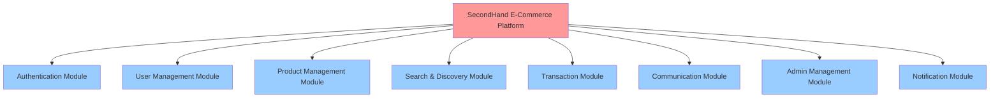
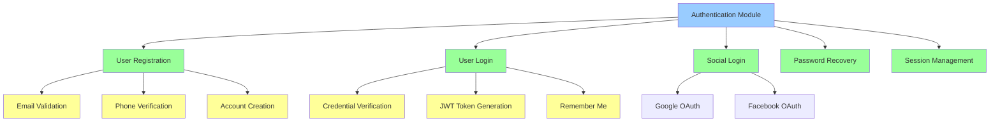
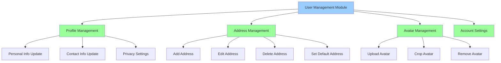
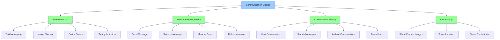

# Biểu Đồ Phân Cấp Chức Năng - SecondHand App (Mermaid Version)

## 1. Cấu trúc tổng thể hệ thống

## 2. Authentication Module

## 3. User Management Module

## 4. Product Management Module

```mermaid
graph TD
    A[Product Management Module] --> B[Product Creation]
    A --> C[Product Editing]
    A --> D[Product Deletion]
    A --> E[Image Management]
    A --> F[Product Status Management]
    
    B --> B1[Product Info Input]
    B --> B2[Category Selection]
    B --> B3[Price Setting]
    B --> B4[Description Writing]
    B --> B5[Image Upload]
    
    C --> C1[Edit Basic Info]
    C --> C2[Update Price]
    C --> C3[Change Category]
    C --> C4[Update Images]
    
    E --> E1[Upload Multiple Images]
    E --> E2[Reorder Images]
    E --> E3[Delete Images]
    E --> E4[Image Compression]
    
    F --> F1[Pending Status]
    F --> F2[Approved Status]
    F --> F3[Rejected Status]
    F --> F4[Sold Status]
    
    style A fill:#99ccff
    style B fill:#99ff99
    style C fill:#99ff99
    style D fill:#99ff99
    style E fill:#99ff99
    style F fill:#99ff99
```

## 5. Search & Discovery Module

```mermaid
graph TD
    A[Search & Discovery Module] --> B[Product Search]
    A --> C[Category Browsing]
    A --> D[Advanced Filtering]
    A --> E[Sorting Options]
    A --> F[Product Recommendations]
    
    B --> B1[Keyword Search]
    B --> B2[Full-text Search]
    B --> B3[Search History]
    B --> B4[Search Suggestions]
    
    D --> D1[Price Range Filter]
    D --> D2[Location Filter]
    D --> D3[Condition Filter]
    D --> D4[Category Filter]
    
    E --> E1[Sort by Newest]
    E --> E2[Sort by Price Low to High]
    E --> E3[Sort by Price High to Low]
    E --> E4[Sort by Popularity]
    
    F --> F1[Based on View History]
    F --> F2[Based on Search History]
    F --> F3[Based on User Preferences]
    F --> F4[Similar Products]
    
    style A fill:#99ccff
    style B fill:#99ff99
    style C fill:#99ff99
    style D fill:#99ff99
    style E fill:#99ff99
    style F fill:#99ff99
```

## 6. Transaction Module

```mermaid
graph TD
    A[Transaction Module] --> B[Order Creation]
    A --> C[Payment Processing]
    A --> D[Order Management]
    A --> E[Order History]
    A --> F[Review & Rating]
    
    B --> B1[Select Product]
    B --> B2[Choose Quantity]
    B --> C3[Confirm Address]
    B --> B4[Apply Promo Code]
    
    C --> C1[Wallet Payment]
    C --> C2[Bank Transfer]
    C --> C3[Payment Confirmation]
    C --> C4[Transaction Recording]
    
    D --> D1[View Order Status]
    D --> D2[Cancel Order]
    D --> D3[Track Order]
    D --> D4[Order Dispute]
    
    F --> F1[Write Review]
    F --> F2[Give Rating]
    F --> F3[Upload Review Images]
    F --> F4[Report Review]
    
    style A fill:#99ccff
    style B fill:#99ff99
    style C fill:#99ff99
    style D fill:#99ff99
    style E fill:#99ff99
    style F fill:#99ff99
```

## 7. Communication Module

## 8. Admin Management Module

```mermaid
graph TD
    A[Admin Management Module] --> B[User Management]
    A --> C[Product Moderation]
    A --> D[Report Handling]
    A --> E[System Analytics]
    A --> F[Content Management]
    
    B --> B1[View All Users]
    B --> B2[User Search & Filter]
    B --> B3[Suspend/Unsuspend Users]
    B --> B4[User Analytics]
    
    C --> C1[Product Review]
    C --> C2[Approval Process]
    C --> C3[Rejection Handling]
    C --> C4[Batch Operations]
    
    D --> D1[View Reports]
    D --> D2[Investigate Issues]
    D --> D3[Take Action]
    D --> D4[Report Analytics]
    
    E --> E1[User Statistics]
    E --> E2[Product Statistics]
    E --> E3[Transaction Analytics]
    E --> E4[Revenue Reports]
    
    F --> F1[Category Management]
    F --> F2[System Settings]
    F --> F3[Banner Management]
    F --> F4[Notification Templates]
    
    style A fill:#99ccff
    style B fill:#99ff99
    style C fill:#99ff99
    style D fill:#99ff99
    style E fill:#99ff99
    style F fill:#99ff99
```

## 9. Notification Module

```mermaid
graph TD
    A[Notification Module] --> B[Push Notifications]
    A --> C[Email Notifications]
    A --> D[In-App Notifications]
    A --> E[Notification Management]
    
    B --> B1[Order Updates]
    B --> B2[Chat Messages]
    B --> B3[Product Updates]
    B --> B4[Promotional Notifications]
    
    C --> C1[Welcome Email]
    C --> C2[Order Confirmation]
    C --> C3[Password Reset]
    C --> C4[Marketing Emails]
    
    D --> D1[System Notifications]
    D --> D2[Message Notifications]
    D --> D3[Order Notifications]
    D --> D4[Account Notifications]
    
    E --> E1[Notification Templates]
    E --> E2[Delivery Tracking]
    E --> E3[User Preferences]
    E --> E4[Bulk Notifications]
    
    style A fill:#99ccff
    style B fill:#99ff99
    style C fill:#99ff99
    style D fill:#99ff99
    style E fill:#99ff99
```

## 10. Phân cấp theo vai trò người dùng

```mermaid
graph TD
    A[User Roles] --> B[Buyer]
    A --> C[Seller]
    A --> D[Admin]
    
    B --> B1[Search Products]
    B --> B2[View Product Details]
    B --> B3[Place Orders]
    B --> B4[Make Payments]
    B --> B5[Write Reviews]
    B --> B6[Chat with Sellers]
    
    C --> C1[Post Products]
    C --> C2[Manage Products]
    C --> C3[Handle Orders]
    C --> C4[Receive Payments]
    C --> C5[Chat with Buyers]
    C --> C6[View Sales Analytics]
    
    D --> D1[User Management]
    D --> D2[Product Moderation]
    D --> D3[Report Handling]
    D --> D4[System Configuration]
    D --> D5[Analytics & Reports]
    D --> D6[Content Management]
    
    style A fill:#ff9999
    style B fill:#99ff99
    style C fill:#99ff99
    style D fill:#99ff99
```

## Chú thích

### Các cấp bậc chức năng:
1. **Platform Level** - Hệ thống tổng thể
2. **Module Level** - Các module chính
3. **Feature Level** - Các tính năng cụ thể
4. **Sub-function Level** - Các chức năng chi tiết

### Màu sắc phân biệt:
- 🔴 **Platform** - Mức độ cao nhất
- 🔵 **Module** - Các module chính
- 🟢 **Feature** - Các tính năng chính
- 🟡 **Sub-function** - Các chức năng chi tiết

### Các luồng chức năng chính:
- **Authentication Flow** → Đăng nhập/đăng ký
- **Product Flow** → Đăng bán/quản lý sản phẩm
- **Transaction Flow** → Mua hàng/thanh toán
- **Communication Flow** → Nhắn tin/tương tác
- **Admin Flow** → Quản trị hệ thống

### Cách sử dụng:
- Copy từng diagram vào file markdown
- Sử dụng trên GitHub/GitLab/VS Code
- Render online tại: https://mermaid.live/
- Combine với các diagrams khác để có cái nhìn toàn diện
