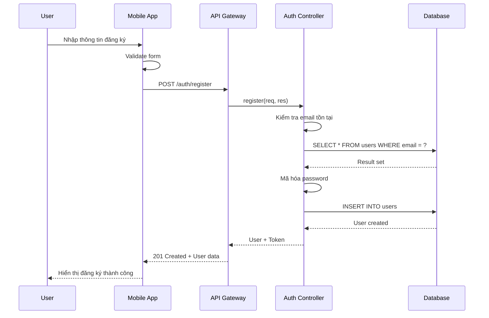
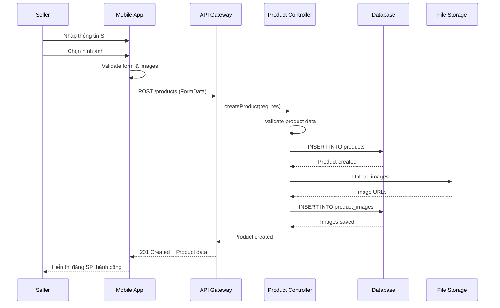
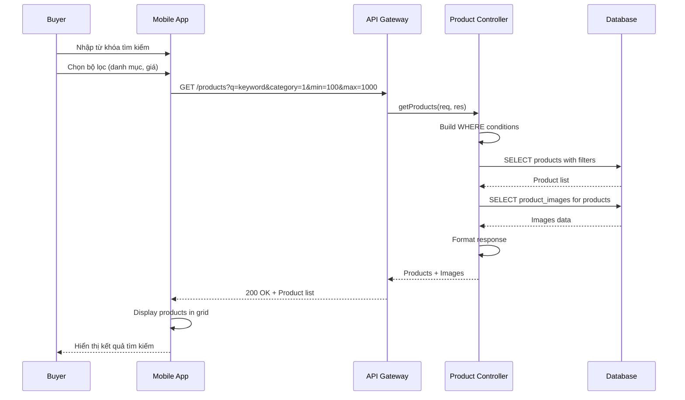
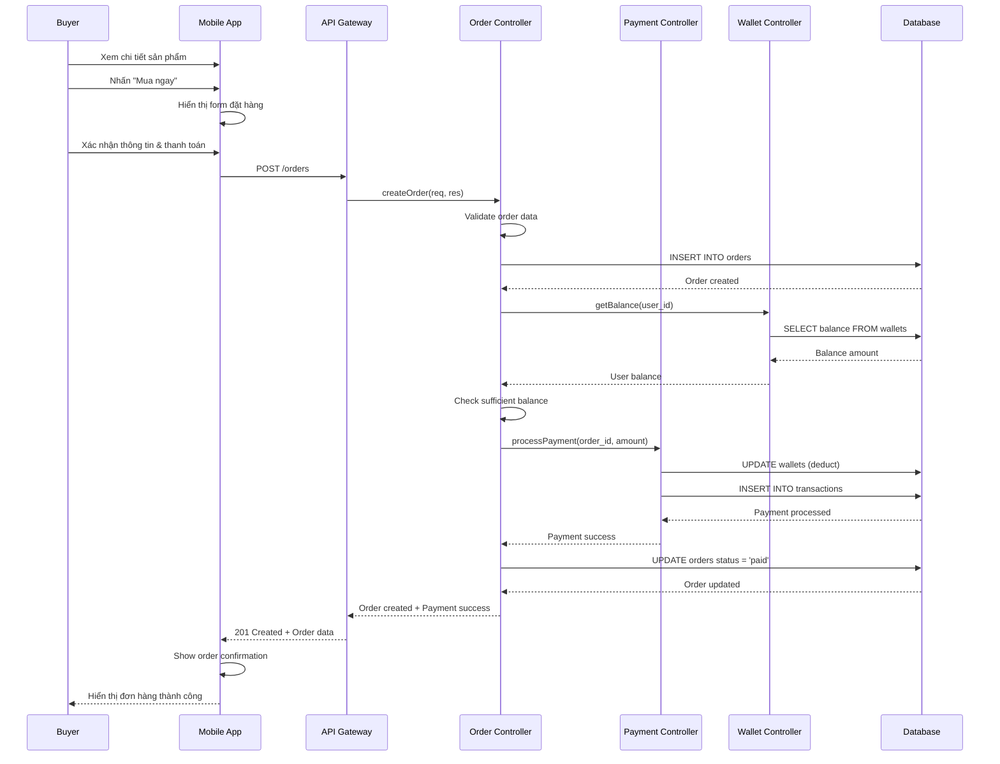
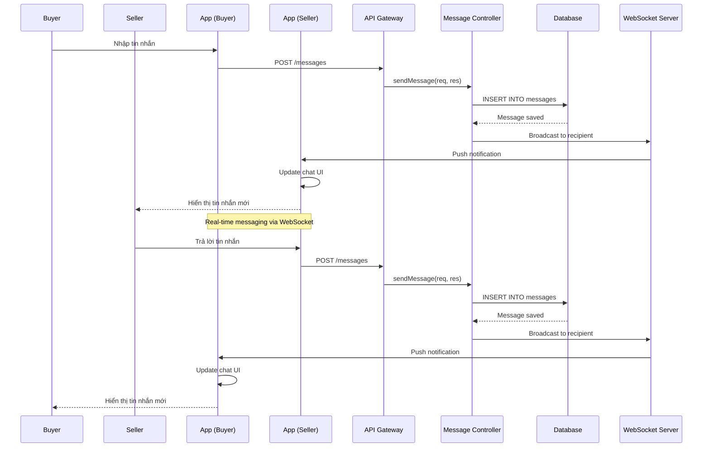
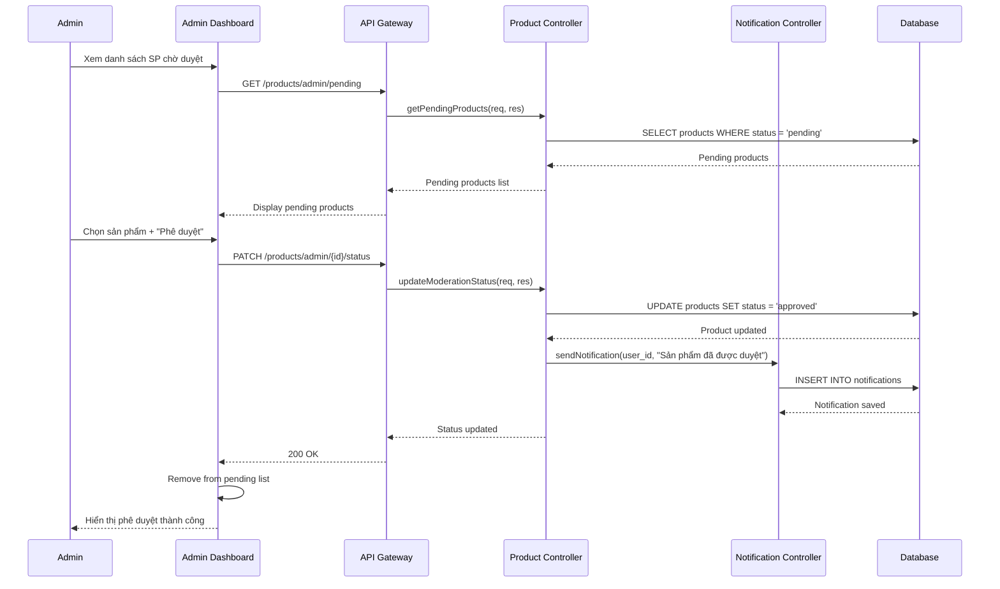

# Biểu Đồ Tuần Tự - SecondHand App (Mermaid Version)

## 1. Đăng ký tài khoản

## 2. Đăng sản phẩm mới

## 3. Tìm kiếm sản phẩm

## 4. Tạo đơn hàng

## 5. Nhắn tin real-time

## 6. Admin phê duyệt sản phẩm

## Chú thích

### Các luồng xử lý chính:
1. **Đăng ký**: Xác thực người dùng mới
2. **Đăng sản phẩm**: Upload và lưu sản phẩm
3. **Tìm kiếm**: Query với filter và pagination
4. **Đơn hàng**: Tạo đơn và xử lý thanh toán
5. **Nhắn tin**: Real-time communication
6. **Admin**: Moderation và quản lý

### Các thành phần tham gia:
- **User/Seller/Buyer/Admin**: Actors
- **Mobile App**: Flutter frontend
- **API Gateway**: Express.js backend
- **Controllers**: Business logic
- **Database**: SQL Server
- **File Storage**: Image uploads
- **WebSocket**: Real-time messaging

### Cách sử dụng:
- Copy từng diagram vào file markdown
- Sử dụng trên GitHub, GitLab, VS Code
- Hoặc render online tại: https://mermaid.live/
