# Sơ Đồ Use Case SecondHand (Mermaid Version)

```mermaid
graph TD
    %% Actors
    User((Người Dùng))
    Seller((Người Bán))
    Buyer((Người Mua))
    Admin((Quản Trị Viên))
    
    %% System Boundary
    subgraph SecondHand System
        %% Authentication
        UC1[Đăng ký]
        UC2[Đăng nhập]
        UC3[Đăng xuất]
        UC4[Quên mật khẩu]
        UC5[Đăng nhập MXH]
        
        %% Profile Management
        UC6[Xem hồ sơ]
        UC7[Chỉnh sửa hồ sơ]
        UC8[Quản lý địa chỉ]
        UC9[Tải avatar]
        
        %% Product Management
        UC10[Đăng sản phẩm]
        UC11[Tải hình ảnh]
        UC12[Chỉnh sửa SP]
        UC13[Xóa SP]
        UC14[Xem SP của tôi]
        UC15[Quản lý trạng thái]
        
        %% Product Browsing
        UC16[Tìm kiếm SP]
        UC17[Lọc danh mục]
        UC18[Lọc giá]
        UC19[Sắp xếp]
        UC20[Xem chi tiết SP]
        
        %% Interactions
        UC21[Thêm yêu thích]
        UC22[Xóa yêu thích]
        UC23[Xem danh sách YT]
        UC24[Đánh giá SP]
        UC25[Báo cáo SP]
        UC26[Nhắn tin]
        UC27[Xem lịch sử TN]
        
        %% Transactions
        UC28[Tạo đơn hàng]
        UC29[Lịch sử mua]
        UC30[Lịch sử bán]
        UC31[Quản lý đơn hàng]
        UC32[Hủy đơn]
        UC33[Xác nhận đơn]
        
        %% Payment
        UC34[Nạp tiền ví]
        UC35[Thanh toán ví]
        UC36[Rút tiền ví]
        UC37[Xem số dư]
        UC38[Lịch sử GD]
        
        %% Admin Functions
        UC39[Phê duyệt SP]
        UC40[Từ chối SP]
        UC41[Quản lý người dùng]
        UC42[Xử lý báo cáo]
        UC43[Xem thống kê]
        UC44[Quản lý danh mục]
        
        %% Notifications
        UC45[Nhận thông báo]
        UC46[Xem lịch sử TB]
        UC47[Đánh dấu đã đọc]
    end
    
    %% Relationships
    %% User - Authentication
    User --> UC1
    User --> UC2
    User --> UC3
    User --> UC4
    User --> UC5
    
    %% User - Profile
    User --> UC6
    User --> UC7
    User --> UC8
    User --> UC9
    
    %% Seller - Product Management
    Seller --> UC10
    Seller --> UC11
    Seller --> UC12
    Seller --> UC13
    Seller --> UC14
    Seller --> UC15
    
    %% Buyer - Product Browsing
    Buyer --> UC16
    Buyer --> UC17
    Buyer --> UC18
    Buyer --> UC19
    Buyer --> UC20
    
    %% User - Interactions
    User --> UC21
    User --> UC22
    User --> UC23
    User --> UC24
    User --> UC25
    User --> UC26
    User --> UC27
    
    %% Transactions
    Buyer --> UC28
    Buyer --> UC29
    Seller --> UC30
    Seller --> UC31
    Buyer --> UC32
    Seller --> UC33
    
    %% Payment
    User --> UC34
    User --> UC35
    User --> UC36
    User --> UC37
    User --> UC38
    
    %% Admin Functions
    Admin --> UC39
    Admin --> UC40
    Admin --> UC41
    Admin --> UC42
    Admin --> UC43
    Admin --> UC44
    
    %% Notifications
    User --> UC45
    User --> UC46
    User --> UC47
    
    %% Inheritance
    Seller -.-> User
    Buyer -.-> User
    
    %% Styling
    classDef actor fill:#e1f5fe,stroke:#01579b,stroke-width:2px
    classDef usecase fill:#f3e5f5,stroke:#4a148c,stroke-width:1px
    classDef system fill:#fff3e0,stroke:#e65100,stroke-width:2px
    
    class User,Seller,Buyer,Admin actor
    class UC1,UC2,UC3,UC4,UC5,UC6,UC7,UC8,UC9,UC10,UC11,UC12,UC13,UC14,UC15,UC16,UC17,UC18,UC19,UC20,UC21,UC22,UC23,UC24,UC25,UC26,UC27,UC28,UC29,UC30,UC31,UC32,UC33,UC34,UC35,UC36,UC37,UC38,UC39,UC40,UC41,UC42,UC43,UC44,UC45,UC46,UC47 usecase
```

## Chú thích
- **User**: Người dùng cơ bản
- **Seller**: Người bán (kế thừa User)
- **Buyer**: Người mua (kế thừa User)  
- **Admin**: Quản trị viên hệ thống
- **UC**: Use Case (Trường hợp sử dụng)

## Cách sử dụng với Mermaid
1. Copy code trên vào file markdown
2. Sử dụng các tool hỗ trợ Mermaid:
   - GitHub/GitLab (tự động render)
   - VS Code với extension Mermaid Preview
   - Online: https://mermaid.live/
   - Notion, Typora, v.v.
